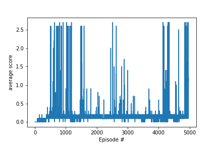

# Project 3 (Deep Reinforcement Learning - Play Tennis)
---
[Andreas Windisch, Feb. 2019](https://www.linkedin.com/in/andreas-windisch-physics/)

This notebook contains the documentation for Project 3 of the [Deep Reinforcement Learning Nanodegree](https://www.udacity.com/course/deep-reinforcement-learning-nanodegree--nd893). Feel free to play with this code as you please. Also, in case you have any questions or comments, or simply want to contact me, use the link to my LinkedIn profile above, or write me directly using [andreas.windisch@yahoo.com](andreas.windisch@yahoo.com). Have fun exploring this nice project! :-)

### 0. Learning Algorithm

As in the previous Continuous Control project, I utilized the Deep Deterministic Policy Gradient (DDPG) approach to train the Agent using discounting, neural networks for the Actor and the Critic, a common replay buffer shared by the two Agents and gradient clipping for the training of the critic. The core implementation is similar to the one used in the previous project. In the following, let me discuss the ingredients in more detail.

#### Neural Networks
   
The networks for the Actor and the Critic use 128 and 64 units in their first and second hidden layers respectively. As activation function, I used the Rectified Linear Unit (ReLU) function. The networks are trained through feed-forward and back-propagation. The output layer of the Actor uses a hyperbolic tangent to ensure that the results are mapped to the range [-1,+1].   
   

#### Discounting
With discounting, we weigh the rewards in future less than the ones in the nearere future. The discounting factor gamma has been chosen to be 0.99 in this case.

#### Replay Buffer
Another issue that can arise in Deep Q Networks is, that we want to make use of very rare events, and also exploit the training Agent's experience as much as we can. One such approach is to maintain a replay buffer, from which we sample experience tuples at random. The buffer is shared by the two Agents. Here we used a buffer size of 10^5. The batch size is 512. The networks are updated after every step.

#### Summary of hyper-parameters

- replay buffer size: 1e5
- batch size: 512
- gamma (discounting): 0.99
- tau (interpolation parameter soft update): 5e-2
- lr_actor (learning rate actor): 1e-4
- lr_critic (learning rate critic): 5e-4
- update rate: 5
- number of updates: 10

### 1. Plot of Rewards
Here is a plot that shows the score over the episodes, as the agent is trained. 

### 2. Ideas for Future Work
Apart from tuning the hyperparameters to make DDPG perform better, one could use the Multi Agent DDPG approach (MADDPG) to further improve training performance.
